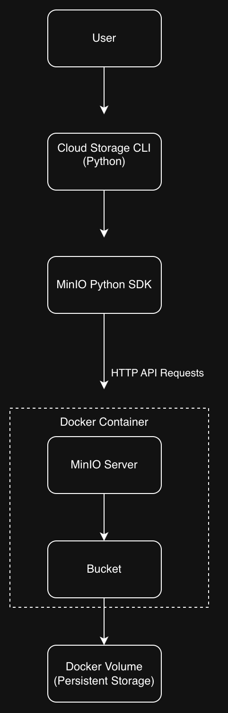

# Cloud Object Storage Client

## Overview

Cloud Object Storage Client is a Dockerized Python application that provides a simple command-line interface (CLI) for interacting with S3-compatible object storage. The project uses MinIO running inside Docker to provide a local object storage environment for development and testing before migrating to AWS S3.

The application demonstrates cloud engineering fundamentals including Docker containerization, object storage, client-server architecture, SDK integration, persistent storage, and Python application development.

---

## Features

- ✅ Upload files to object storage
- ✅ List files stored in a bucket
- ✅ Download files from object storage
- ✅ Delete files from object storage
- ✅ Interactive command-line interface (CLI)
- ✅ Graceful error handling
- ✅ Persistent storage using Docker volumes

---

## Technologies Used

- Python
- Docker
- Docker Compose
- MinIO
- Git
- GitHub
- Visual Studio Code

---

## Skills Demonstrated

- Docker containerization
- Docker Compose configuration
- Python application development
- Object storage fundamentals
- Client-server architecture
- SDK integration
- Persistent storage with Docker volumes
- Command-line interface (CLI) development
- Error handling
- Git version control

---

## Architecture

The diagram below illustrates how the Cloud Storage CLI communicates with the MinIO server to perform object storage operations. The MinIO server runs inside a Docker container, and uploaded objects are stored in a bucket backed by a persistent Docker volume.



---

## How to Run

### 1. Clone the repository

```bash
git clone <repository-url>
cd docker-cloud-backup
```

### 2. Start the MinIO server

```bash
docker compose up
```

### 3. Activate the Python virtual environment

**macOS/Linux**

```bash
source venv/bin/activate
```

**Windows**

```bash
venv\Scripts\activate
```

### 4. Run the application

```bash
python app.py
```

---

## What I Learned

The biggest lesson from this project was learning by building instead of memorizing commands. Throughout development, I focused on understanding how each technology worked together rather than simply making the application function.

This project strengthened my understanding of:

- Docker images and containers
- Docker Compose
- Object storage concepts
- Buckets and objects
- Docker volumes
- Client-server architecture
- SDK integration
- HTTP API communication
- Error handling
- Python application design
- Git version control

---

## Future Improvements

- Migrate the storage backend from MinIO to AWS S3
- Implement AWS IAM authentication
- Provision infrastructure using Terraform
- Improve logging and monitoring
- Add automated testing
- Build a web interface for interacting with object storage

This project is intended to evolve from a local MinIO implementation into a production-oriented cloud storage application using AWS services and Infrastructure as Code.